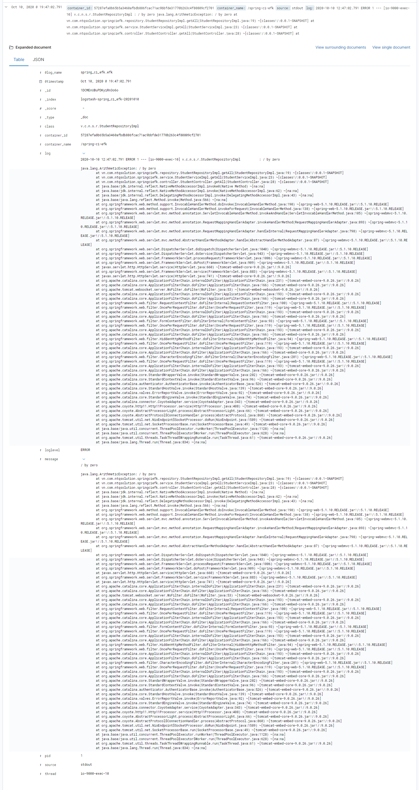

# EFK configuration with X-pack security

In this repo, I wanna talk about EFK configuration for catching spring boot default log and exception too.

## 1. Introduction

There're a lot of things to talk about EFK and thre're a lot of releated resources, too. So I don't wanna talk, in detail, about EFK here. Please Google for some following quetions if you haven't heard about EFK:

- What is EFK?
- What does EFK do for DevOps?
- The EFK mechanism to manage log?
- Why EFK, not ELK?


EFK = Elasticsearch + Fluentd + Kibana

## 2. Configuration

### 2.1 Environment

In this configuration, I'm using CentOS 7 with:

- Open JDK 8
- Maven
- Docker version 19.03.13
- docker-compose version 1.27.4

### 2.2 Configuration

#### 2.2.1 Docker configuration

In this section, we're going to create the docker config for our efk stack. The first, of course, we need a [`docker-compose.yml`](./docker-compose.yml) file:

```yaml
version: "3.3"

services:
  elasticsearch:
    image: ${ELASTICSEARCH_IMAGE}
    restart: always
    volumes:
      - ./config/elasticsearch.yml:/usr/share/elasticsearch/config/elasticsearch.yml
    environment:
      - "ES_JAVA_OPTS=-Xms256m -Xmx256m"
    ports:
      - 9200:9200
    networks:
      - efk_net

  fluentd:
    build: ./fluentd
    restart: always
    volumes:
      - ./fluentd/etc:/fluentd/etc
    ports:
      - 24224:24224
    networks:
      - efk_net

  kibana:
    image: ${KIBANA_IMAGE}
    restart: always
    volumes:
      - ./config/kibana.yml:/usr/share/kibana/config/kibana.yml
    depends_on:
      - elasticsearch
    ports:
      - 5601:5601
    networks:
      - efk_net

networks:
  efk_net:
    driver: bridge
```

With the environment variables are defined in [`.env`](./env) file:

```properties
ELASTICSEARCH_IMAGE=docker.elastic.co/elasticsearch/elasticsearch:7.9.2
FLUENTD_IMAGE=fluent/fluentd:stable
KIBANA_IMAGE=docker.elastic.co/kibana/kibana:7.9.2
```

Besides, we also enable the `X-pack security` of Elasticsearch inside the [elasticsearch config file](./config/elasticsearch.yml):
```yml
node:
  name: truongbb-es

discovery:
  type: single-node

bootstrap:
  memory_lock: true

network:
  host: 0.0.0.0

xpack:
  security:
    enabled: true
```

We need to config Kibana to in [`kibana.yml`](./config/kibana.yml) file and you must fill in the password you want, whatever, and remember it, we need use this password to configurate later:

```yml
server:
  name: kibana
  host: "0"
elasticsearch:
  hosts: ["http://elasticsearch:9200"]
  username: kibana_system
  password: <your password>
```

At this time, we need define a [`Dockerfile`](./fluentd/Dockerfile) to use some fluentd plugins. These plugins will help us communicating with elasticsearch (`fluent-plugin-elasticsearch`) and catching spring boot log, exception (`fluent-plugin-concat`):

```Dockerfile
ARG FLUENTD_IMAGE
FROM ${FLUENTD_IMAGE}

RUN apk add --update --virtual .build-deps \
    sudo build-base ruby-dev \
    && sudo gem install \
    fluent-plugin-elasticsearch \
    && sudo gem install fluent-plugin-concat \
#    && sudo gem sources --clear-all \
#    && apk del .build-deps \
#    && rm -rf /var/cache/apk/* \
#    /home/fluent/.gem/ruby/2.3.0/cache/*.gem
```

And the last part, the [`fluentd.conf`](./fluentd/etc/fluent.conf) file. Please fill in the password before save file (you can type whatever you want but remeber it because we need use this password later to configurate):
```conf
# Fluentd main configuration file
# Reference: https://docs.fluentd.org/v1.0/articles/config-file

# Set Fluentd to listen on port 24224, listening on all hosts
<source>
  @type forward
  port 24224
  bind 0.0.0.0
  @log_level error
</source>

# Concat when log has multiple line (including exception)
<filter spring-ci-efk.efk>
  @type concat
  key log
  stream_identity_key container_id
  multiline_start_regexp /(?<time>\d{4}-\d{2}-\d{2} \d{2}:\d{2}:\d{2}.\d{3})(\s*)(?<loglevel>[A-Z]*)(\s*)(?<pid>[0-9]*) --- \[(?<thread>.*)\] (?<class>[^:]*) : (?<message>(.|\s)*)\n*/
  multiline_end_regexp  /(^\t(at) (?<method>[^:(]*)[(](?<errorClass>[^:]*):(?<errorLine>\d*)[)](\s*)(~\[(?<lib>.*)\])*\n+)|(^\t(...) .*)/
</filter>
# Parse log to get infor related to time, log level, pid, thread, class and message
<filter spring-ci-efk.efk>
  @type parser
  key_name log
  reserve_data true
  <parse>
    @type regexp
    expression /(?<time>\d{4}-\d{2}-\d{2} \d{2}:\d{2}:\d{2}.\d{3})(\s*)(?<loglevel>[A-Z]*)(\s*)(?<pid>[0-9]*) --- \[(?<thread>.*)\] (?<class>[^:]*) : (?<message>(.|\s)*)/
  </parse>
</filter>


# Events will be stored on Elasticsearch.
<match spring-ci-efk.efk>
  @type copy
  <store>
    @type elasticsearch
    host elasticsearch
    port 9200
    user fluentd
    password '<your password>'
    index_name fluentd
    type_name fluentd
    logstash_format true
    #logstash_prefix fluentd
    logstash_dateformat spring-ci-efk-%Y%m%d
    include_tag_key true
    tag_key @log_name
    flush_interval 1s
  </store>
</match>
# All events will be printed to stdout
<match **>
  @type stdout
</match>
```

Please note that the `spring-ci-efk.efk` tag is the tag of the spring boot log I will use later.


OK, enough coding, now, just `up`:
```bash
docker-compose up
```

#### 2.2.2 Elasticsearch security configuration

Don't be hurry, you can't enter the kibana web right now, because if you check the log, you can see something like that:

```
fluentd_1        | 2020-10-10 12:46:41 +0000 [error]: #0 unexpected error error_class=Elasticsearch::Transport::Transport::Errors::Unauthorized error="[401] {\"error\":{\"root_cause\":[{\"type\":\"security_exception\",\"reason\":\"unable to authenticate user [fluentd] for REST request [/]\",\"header\":{\"WWW-Authenticate\":\"Basic realm=\\\"security\\\" charset=\\\"UTF-8\\\"\"}}],\"type\":\"security_exception\",\"reason\":\"unable to authenticate user [fluentd] for REST request [/]\",\"header\":{\"WWW-Authenticate\":\"Basic realm=\\\"security\\\" charset=\\\"UTF-8\\\"\"}},\"status\":401}"
```

Oops! This is authentication error --> 401. Your fluentd cannot connect to elasticsearch, because of the `x-pack security`, you've just turn it on but you haven't configurated it yet. Really, you can check that by call the `curl` request:
```
curl -X GET localhost:9200
```
and see the result is:
```json
{"error":{"root_cause":[{"type":"security_exception","reason":"unable to authenticate user [elastic] for REST request [/]","header":{"WWW-Authenticate":"Basic realm=\"security\" charset=\"UTF-8\""}}],"type":"security_exception","reason":"unable to authenticate user [elastic] for REST request [/]","header":{"WWW-Authenticate":"Basic realm=\"security\" charset=\"UTF-8\""}},"status":401}
```

The 401, too. Right?

So, the next work is to config the elasticsearch security. First, we need run the shell command inside the elasticsearch container by using this command:
```bash
docker-compose exec elasticsearch bash
```

Note that you must at the directory which is the same with one contains `docker-compose.yml` file.

And your shell is changed from, something like that:
```bash
[root@localhost efk-docker-config]#
```

to, something like that:
```bash
[root@e6d53b30e238 elasticsearch]#
```

with `e6d53b30e238` is the elasticsearch container_id.

OK, we've been inside the elasticsearch container. And now, to config, run this command:
```bash
bin/elasticsearch-setup-passwords interactive
```

You will set up the password for all of the default accounts of elasticsearch, remember the password you filled in of the `kibana.yml` and `fluentd.conf` files to use in this step. Output is:
```bash
[root@e6d53b30e238 elasticsearch]# bin/elasticsearch-setup-passwords interactive
Initiating the setup of passwords for reserved users elastic,apm_system,kibana,kibana_system,logstash_system,beats_system,remote_monitoring_user.
You will be prompted to enter passwords as the process progresses.
Please confirm that you would like to continue [y/N]y


Enter password for [elastic]:
Reenter password for [elastic]:
Enter password for [apm_system]:
Reenter password for [apm_system]:
Enter password for [kibana_system]:
Reenter password for [kibana_system]:
Enter password for [logstash_system]:
Reenter password for [logstash_system]:
Passwords do not match.
Try again.
Enter password for [logstash_system]:
Reenter password for [logstash_system]:
Enter password for [beats_system]:
Reenter password for [beats_system]:
Enter password for [remote_monitoring_user]:
Reenter password for [remote_monitoring_user]:
Changed password for user [apm_system]
Changed password for user [kibana_system]
Changed password for user [kibana]
Changed password for user [logstash_system]
Changed password for user [beats_system]
Changed password for user [remote_monitoring_user]
Changed password for user [elastic]
[root@e6d53b30e238 elasticsearch]# 
```

OK, so, let's check it by run `curl` command again, but with the authentication option, using superuser account (`elastic` is the superuser):
```bash
curl -X GET -u elastic:<your password> localhost:9200
```

And, ta da!
```json
{
  "name" : "truongbb-es",
  "cluster_name" : "elasticsearch",
  "cluster_uuid" : "ndbgWn2TSA-Fbe6DB0Z3iQ",
  "version" : {
    "number" : "7.9.2",
    "build_flavor" : "default",
    "build_type" : "docker",
    "build_hash" : "d34da0ea4a966c4e49417f2da2f244e3e97b4e6e",
    "build_date" : "2020-09-23T00:45:33.626720Z",
    "build_snapshot" : false,
    "lucene_version" : "8.6.2",
    "minimum_wire_compatibility_version" : "6.8.0",
    "minimum_index_compatibility_version" : "6.0.0-beta1"
  },
  "tagline" : "You Know, for Search"
}
```

#### 2.2.3 Kibana configuration

Elastich authentication is OK! Now, open your web browser and go to the `<ip>:5061` with `ip` is your efk server ip.


Login with the `elastic` account (password is configurate before). At the home page, go to the security setting page:


After that, create user `fluentd` (with the password is filled in the [`fluentd.conf`](./fluentd/etc/fluetnd.conf) file) by click the `Create user` button:


Don't forget add role for your account! <b>*This picture is just and example*</b>. I highly recommend you create a role before creating user, and grant this role to new user you've created. Don't grant `superuser` role.

OK, now you check the log of docker, the fluentd 401 error log is now disappeared because we've just configurated the `fluentd` account. 

#### 2.2.4 Spring boot configuration and showing off result

On the other hand, in my spring boot project, I've created a `docker-compose.yml` file look like that:

```yml
version: '3.3'

services:
  spring-ci-service:
    build:
      context: ../
      args:
        PROJECT_VERSION: ${PROJECT_VERSION}
        JDK_BASE_IMAGE: ${JDK_BASE_IMAGE}
    image: "spring-ci-efk:${TAG}"
    container_name: "spring-ci-efk"
    network_mode: "host"
    environment:
      - 'SPRING_PROFILE_ACTIVE=dev,swagger'
      - 'DEBUG'
    restart: always
    ports:
      - 9000:9000
    logging:
      driver: fluentd
      options:
        fluentd-address: <ip>:24224
        fluentd-async-connect: 'true'
        fluentd-retry-wait: '1s'
        fluentd-max-retries: '30'
        tag: 'spring-ci-efk.efk'
```
with the tag `spring-ci-efk.efk` is the same in the [`fluentd.conf`](./fluentd/etc/fluent.conf) file.

And then I `up` my docker spring container, go to kibana page and create the index pattern:


My pattern is: `logstash-spring-ci-efk-*`. Here's my result:


With the fluentd plugin and our config, this EFK stack can catch the exception, like this:



Good luck and happy hacking!